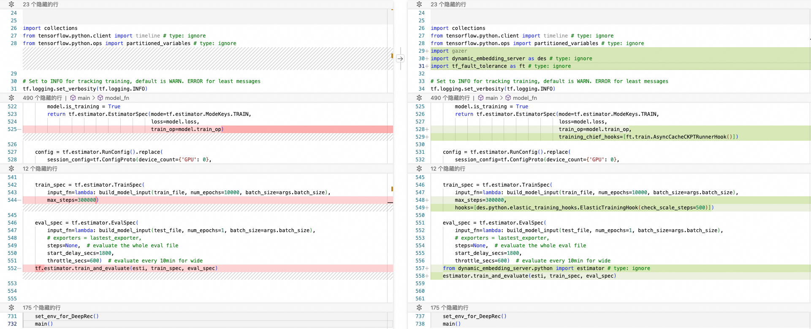

# DeepRec Extension

## Introduction

DeepRec Extension is an easy-to-use, stable and efficient large-scale distributed training system based on [DeepRec](https://github.com/DeepRec-AI/DeepRec).

## Features


### Auto-scaling

Large-scale distributed training tasks contain many roles, such as chief, ps, and worker. Native interfaces for distributed training tasks require users to specify the number and resource allocation for each role, which makes a significant challenge for users. For users, it is difficult to configure these hyperparameters appropriately to ensure high resource utilization for training tasks. In many scenarios, users configure them too small lead to Out-of-Memory (OOM) errors in their training tasks, while in other scenarios, excessive configurations result in wasted resources due to over-allocation.

Some solutions achieve elastic training by stopping training and restarting it integrating checkpointing mechanisms. This approach is intrusive to users, as the process of halting and resuming training requires resources, resulting in an increase in overall training time. This overhead is particularly significant in scenarios where training tasks frequently require elasticity adjustments and cannot be overlooked. Restoring model with latest checkpoint causes training samples/model rollback and compute resources wasting.

Dynamic Embedding Server(DES) scale-up/scale-down PS nodes without job restart. It makes parameters redistribution and server dynamic addition and deletion automatically.

### Gazer

Gazer is a metrics system for DeepRec/TensorFlow. It collects runtime machine load status and graph execution information, reporting them to the Master node, making decision elastic scaling of tasks by the master or presenting them to users via the TensorBoard interface.

### Fast-fault-tolerance

Existing checkpoint mechanisms, when a PS node fails unexpectedly, it requires restarting the entire task and reverting the model to the previous checkpoint. This process significantly squanders the training outcomes from the previous checkpoint up until the node failure. Moreover, inconsistencies in the rollback of the distributed training model and samples give rise to the additional issue of sample loss.

Firstly, we support the consistency of the sample and the model by extra checkpoint. Secondly, we restart single PS node when PS node crash instead of restarting job. Lastly, we make backups of the model parameters to enable rapid recovery in the event of PS node failures.

### Master Controller

In TensorFlow training tasks, there is a lack of a task-level master node for managing the state control of all the aforementioned functionalities. Taking into account the resource scheduling ecosystem of cloud-native K8S, we have extended tfjob in Kubeflow by adding a CRD with master capabilities.

## How to build

1. clone extension source code & init submodule

```shell
git clone git@github.com:DeepRec-AI/extension.git /workspace/extension && cd /workspace/extension
git submodule update --init --recursive
```

2. start container

```shell
docker run -ti --name deeprec-extension-dev --net=host -v /workspace:/workspace alideeprec/extension-dev:cpu-py36-ubuntu18.04 bash
```

3. build all python wheel modules

```shell
cd /workspace/extension
make gazer des master tft -j32
```

## How to deploy

### Prerequisites

1. `golang` version>=1.20.12

2. `kubectl` client [install kubectl on linux](https://kubernetes.io/docs/tasks/tools/install-kubectl-linux/#install-kubectl-binary-with-curl-on-linux)

### Installation

1. install & configure kubectl client

```shell
$HOME/.kube/config
```

2. deploy kubeflow-operator

```shell
# clone kubeflow source code
git clone git@github.com:kubeflow/training-operator.git /workspace/training-operator && cd /workspace/training-operator
# install kubeflow CRD
make install
# deploy kubeflow image with v1.7.0
make deploy IMG=kubeflow/training-operator:v1-5525468
```

3. build & deploy aimaster-operator image

```shell
cd /workspace/extension/aimaster_operator/
# install aimaster-operator CRD
make install
# build aimaster-operator image
# {image} is aimaster-operator image name
make docker-build IMG={image}
# push image to YOUR dockerhub
# such as: Alibaba Container Registry, ACR, https://cr.console.aliyun.com
make docker-push IMG={image}
# deploy aimaster-operator image to k8s
make deploy IMG={image}
```

4. build aimaster image

```shell
cd /workspace/extension
# build aimaster image
make master-build-docker
# push image to YOUR dockerhub
# such as: Alibaba Container Registry, ACR, https://cr.console.aliyun.com
docker push {image} {namespace/image:tag}
```

5. build deeprec-extension image

```shell
cd /workspace/extension
# build deeprec-extension image
bash tools/examples/build_docker.sh
# push image to YOUR dockerhub
# such as: Alibaba Container Registry, ACR, https://cr.console.aliyun.com
docker push {image} {namespace/image:tag}
```

## How to use

```shell
kubectl apply -f tools/examples/extension_test.yaml
```

## Latest Images

### aimaster-operator

```shell
alideeprec/extension-operator-release:latest
```

### aimaster

```shell
alideeprec/extension-aimaster-release:latest
```

### extension

deeprec + estimator + gazer + des + tf-fault-tolerance + deeprec-master

```shell
alideeprec/extension-release:latest
```

## Example on [ACK](https://www.aliyun.com/product/kubernetes)

1. Create ACK

2. deploy kubeflow-operator

3. deploy aimaster-operator

4. execute training job

```shell
kubectl apply -f tools/examples/extension_test.yaml
```

### Estimator sample code

[train.py](tools/examples/train.py)

